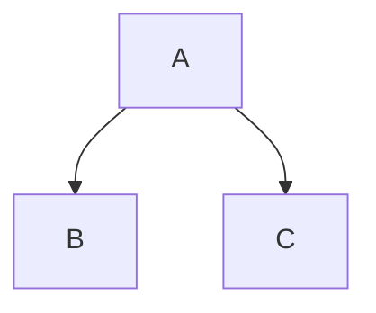
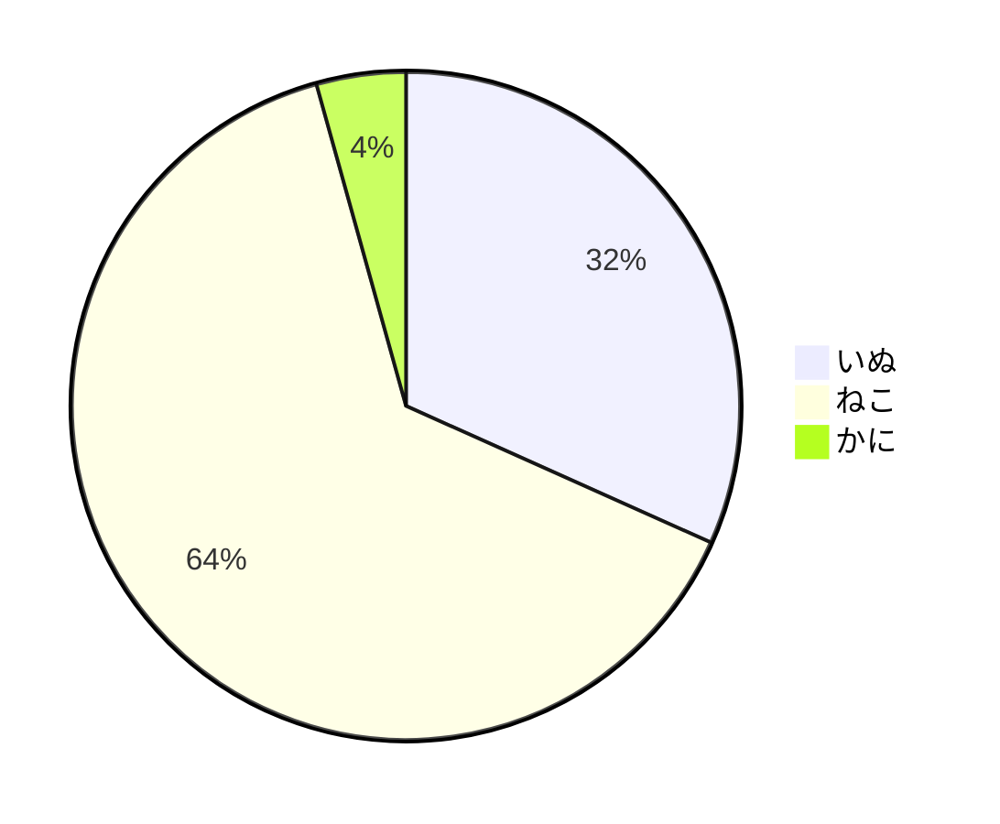

# VSCodeでmermaidを利用する方法や便利な拡張機能

## 基本
**Markdown**を使います。

コードブロックでmermaidを指定してその中にコードを書いていきます。

>\``` mermaid
>\```

###### 例１



> \``` mermaid
> graph TD;
> A --> B
> A --> C
> \```

###### 例２



> \```mermaid
> pie
> "いぬ" : 110
> "ねこ" : 222
> "かに" : 15
> \```

---

## あるといいかもしれない拡張機能
Markdown関係の拡張機能を利用すると、mermaidの記述も少しは楽になるかもしれません。

##### Markdown All in One
主な機能は以下の通りです。
|機能|説明|
|---|---|
|キーボードショートカット|太字にしたり、見出しレベルを変えるなどすることができます。|
|目次作成|ドキュメント内の見出しを検出し、目次を作成してくれます。|
|見出しナンバリング|(省略)|
|リスト編集補完|箇条書・番号付きリストを書いて改行すると、次の行もその書式になる。tabでインデント。|

---

## 参考
[使ってみよう！VSCode+mermaid – 自主的20%るぅる](https://www.agent-grow.com/self20percent/2020/03/05/%E4%BD%BF%E3%81%A3%E3%81%A6%E3%81%BF%E3%82%88%E3%81%86%EF%BC%81vscodemermaid/)
[Visual Studio Code拡張 Markdown All in One](https://zenn.dev/ctrlkeykoyubi/articles/vscode-markdown-all-in-one)