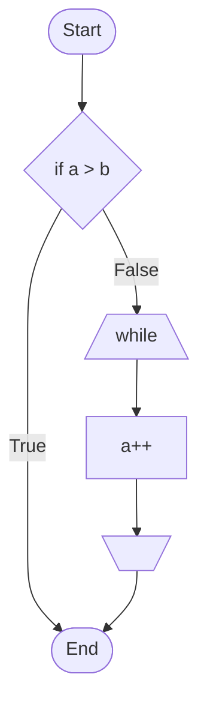
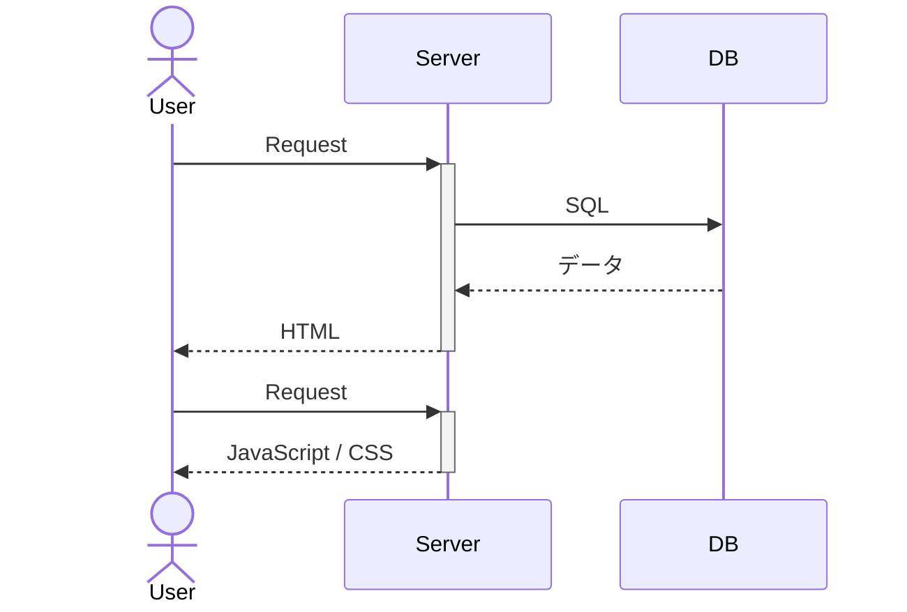
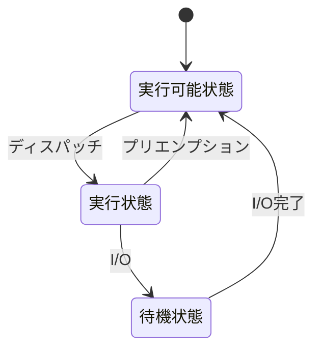
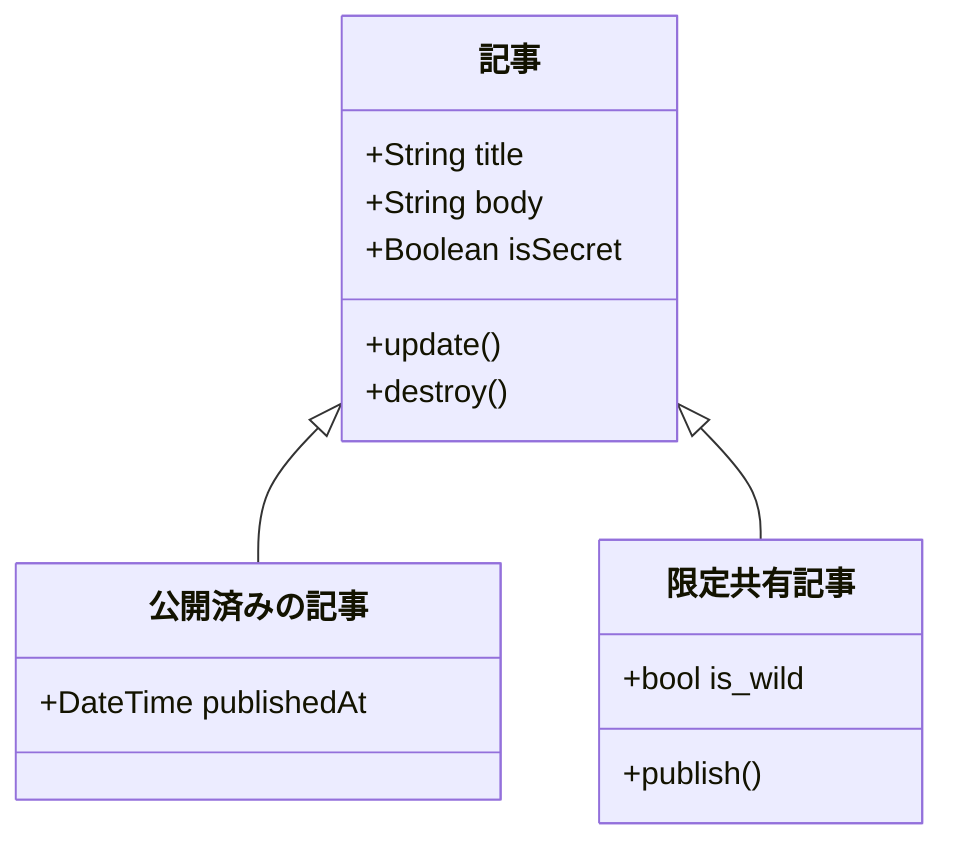
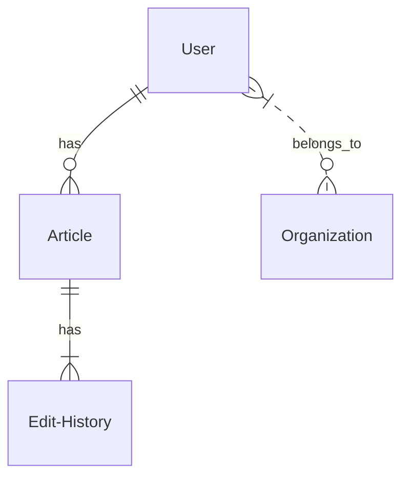
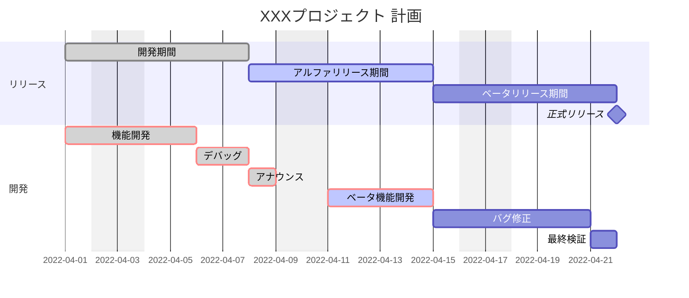
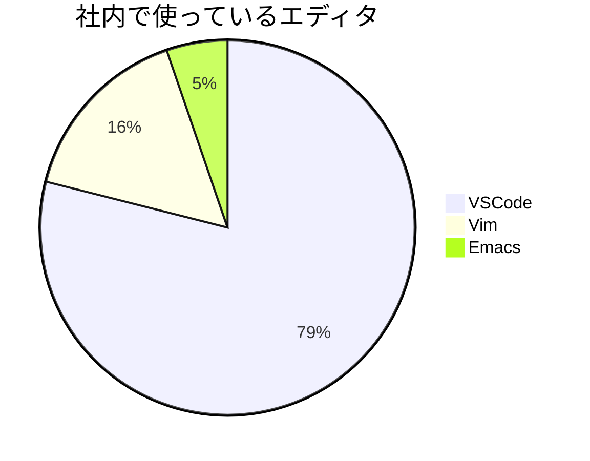

# mermaidで記述できるダイアグラムの記述例とコード

テキストのみで手軽にきれいなダイアグラムを書くことができるツール**mermaid**ですが、どのようなものが作れるのか以下に例を示します。
※コードはバッククォート3つ(```)で囲み、mermaidを指定すること。

## フローチャート



```
graph TB
  Start([Start])-->B{if a > b}
  B-->|True| End
  B-->|False| IFS[/while\]
  IFS-->C[a++]
  C-->IFB[\  /]
  IFB-->End([End])
```

---

## シーケンス図



```
sequenceDiagram
  actor U as User
  participant S as Server
  participant DB
  U->>+S: Request
  S->>DB: SQL
  DB-->>S: データ
  S-->>-U: HTML
  U->>+S: Request
  S-->>-U: JavaScript / CSS
```

---

## 状態遷移図



```
stateDiagram-v2
  [*] --> 実行可能状態
  実行可能状態 --> 実行状態: ディスパッチ
  実行状態 --> 実行可能状態: プリエンプション
  実行状態 --> 待機状態: I/O
  待機状態 --> 実行可能状態: I/O完了
```

---

## クラス図


```
classDiagram
  記事 <|-- 公開済みの記事
  記事 <|-- 限定共有記事
  class 記事{
    +String title
    +String body
    +Boolean isSecret
    +update()
    +destroy()
  }
  class 公開済みの記事{
    +DateTime publishedAt
  }
  class 限定共有記事{
    +bool is_wild
    +publish()
  }
```

---

## ER図


```
erDiagram
    User ||--o{ Article : has
    Article ||--|{ Edit-History : has
    User }|..o{ Organization : belongs_to
```

---

## ガントチャート

```
gantt
  dateFormat  YYYY-MM-DD
  title       XXXプロジェクト 計画
  excludes    weekends

  section リリース
  開発期間        :done, 2022-04-01, 2022-04-08
  アルファリリース期間 :active, 5d
  ベータリリース期間  :5d
  正式リリース      :milestone, 0d

  section 開発
  機能開発      :crit, done, 2022-04-01, 3d
  デバッグ      :crit, done, 2d
  アナウンス     :crit, done, 1d
  ベータ機能開発 :crit, active, 4d
  バグ修正      :4d
  最終検証      :1d

```

## 円グラフ

```
pie title 社内で使っているエディタ
  "VSCode" : 30
  "Vim" : 6
  "Emacs" : 2
```


---

## 参考

[【Mermaidの紹介】Qiitaでダイアグラム・チャートが簡単に書けるようになりました！](https://qiita.com/Qiita/items/c07f3262d8f3b25f06c9)
