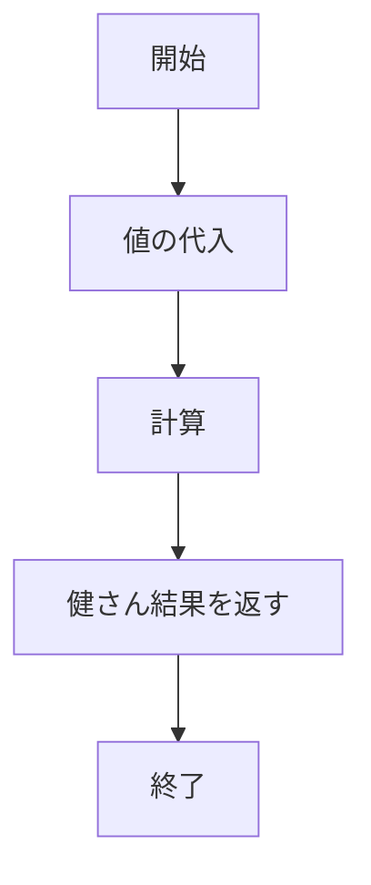
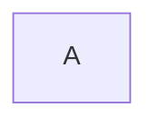
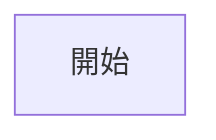
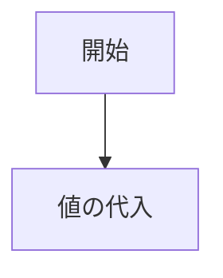

# mermaidで記述できるダイアグラムのチュートリアル

実装したい処理をコーディングするときに、フローチャートがあれば便利かもしれません。

### フローチャートとは
処理の流れを何種類かの箱と戦で表現した図です。
簡単な例を以下に示します。



### 書いてみる
今回は、上記のフローチャートを書いてみましょう。

#### 定義
```
graph TD;
```
「graph」に続けて図形の向きを指定します。
向きの指定は以下の通りです。
|オプション|意味|
|---|---|
|TD(top-down)|上から下へ|
|BT(bottom-top)|下から上へ|
|RL(right-left)|右から左へ|
|LR(left-right)|左から右へ|
|TD(top-down)|上から下へ|

#### ノード
idのみだと、プレビューの箱の中にはそのidが入ります。

```
A
```



idとは別のテキストを箱の中に入れたいときはidの後ろに[]wpつけます。

```
A[開始]
```



#### ノードとノードをつなげる

「-->」でつなぐことができます。

```
A[開始] --> B[値の代入]
```



この調子でノードとノードをつなげていきましょう。

```
graph TD;
A[開始] --> B[値の代入]
B --> C[計算]
C --> D[健さん結果を返す]
D --> E[終了]
```


### 完成！
無事にフローチャートを完成させることができました。
これで少しはコーディングもやり易くなったことでしょう。

もっとmermaidについて知りたい方は以下をご覧ください。

[mermaid公式ページ](https://mermaid.js.org/)


---

参考：[「分かりそう」で「分からない」でも「分かった」気になれるIT用語辞典](https://wa3.i-3-i.info/word13271.html)

参考：[Mermaid記法 | フローチャートを描く](https://miseruit.com/2023/02/24/post-4281/)

参考：[フローチャート - 基本構文](https://mermaid.js.org/syntax/flowchart.html)